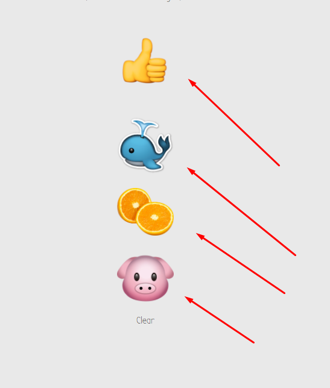

# Basic Example of DOM Manipulation Using JQuery

An incredibly basic web site that changes the color of the background with the click of one of the emojis.

<sup>**Designed for demostration purposes**</sup>

[](https://github.com/dwyl/esta/issues)

### [Live Site](https://ptums.github.io/basic-dom-manipulation-using-jquery/)

I am looking for recent bootcamp grads, bootcamp students, or any coders who are looking to up their coding skills and learn more about javascript make a fun educational website based on this content. 

## Build status


## Installation

``` 
  git clone https://github.com/ptums/basic-dom-manipulation-using-jquery.git
```

## How It Works

When one of the emojis is clicked, a function using JQuery is fired


This is that function

```
function changeColor(){
    $('#colors li').on('click', function(){
      var color = $(this).data('color');
      var animations = [
        'animated bounce',
        'animated jello',
        'animated rubberBand',
        'animated rotateIn',
        'animated zoomIn',
        'animated pulse'
      ];
      var selectedAnimation = animations[Math.floor(Math.random()*animations.length)];
      
      $(this).addClass(selectedAnimation);

      if(color === 'gray'){
        $('body').css('background-color', '#e9e9e9');
      }else{
        $('body').css('background-color', color);
      }

    });
};
```

What this function does is identify what emjoi is exactly being clicked then taking a CSS animation from the animate.css and applying that class to the DOM elment where the image of the emoji is being stored. 

Then it changes the background color based on the value in ```data-color``` attribute, which is assinged to each DOM element containaing an emoji.


## Development

Fork this repo, open the repository in your favorite code editor and get hacking!

## Contribute

1. [Fork it](https://github.com/ptums/basic-dom-manipulation-using-jquery/fork)
2. Create your feature branch (git checkout -b feature/fooBar)
3. Commit your changes (git commit -am 'Add some fooBar'). Please use [Udacity Git Commit Message Style Guide](https://udacity.github.io/git-styleguide/) when writing commit messages.
4. Push to the branch (git push origin feature/fooBar)
5. Create a new Pull Request
